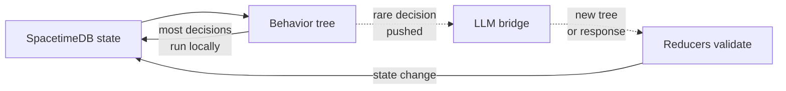

## Why was i vibe coding an LLM-based MMO ?
Why not ? duh.  

I was originally what you would call as "AI hater" up to, like for many people, the start of this year. I ended up doing a full 180 on that, becoming fully AI-pilled: local models, inference engines, agent harnesses, etc.. the whole package, but that's a story for another time.  

[The release of Opus 4.5](https://www.anthropic.com/news/claude-opus-4-5) was truly a pivotal moment, i have to reluctantly give Anthropic that, it made me realise these models might actually be useful *tools* for software engineering even tho, like most engineers, i struggled to come to terms with the fact that the skills i worked hard for were becoming partially useless (even if they don't realise/admit it).
Before that, the whole tab autocomplete and sub-par code generation was just un-interesting to me.  

What does this have to do with this article ? EVERYTHING. This is my first fully vibe coded project.  

Earlier that year (2025) i got hit by the infamous layoff hammer, and it hurt, like a lot. I found myself stuck in the current job market purgatory, aimlessly applying to every open position under the sun, blaming the "system" and honestly just being miserable.  
Luckly, after some months, the monkey in my brain decided to lock in, it was time to look at the future. I wanted to see what i was able to achieve trying to maximise the usage of this new shiny *tool*.  

I have always been what some may call a "nerd", before it was cool, not even sure it is actually cool. I have always been frustrated by the fact that there are no good "new" MMOs, I really liked the premise of these games, but the lack of current-gen titles always precluded me from actually playing one.  
Maybe that's for the best, kowing me, i'd get addicted.  

Given this and my new found hunger in learning something new I ended up working on my game [SAO: Slop Art Online](https://github.com/devteapot/slop-art-online). Hey, listen..., this was the funniest stuff ever when I got the idea, don't judge me. For those who don't get it, maybe it's for the best.

## How i got to designing a protocol from a slop MMO game ?
By chance.  

For being my first "real" game I made some non-optimal choices on my tech stack: [Rust](https://rust-lang.org/), [Bevy](https://bevy.org/) and [SpacetimeDB](https://spacetimedb.com/). Don't get me wrong, they are amazing, but not necessarely what I would suggest to someone new to game development.  
This was intentional, I wanted to maximise the friction between me and the low-level understanding of what I was building, nothing personal my fellow rustaceans. The only real major downside is that you don't get to rewrite your project to Rust if you use Rust to begin with.  

The core idea of the game is an MMO where NPCs are treated and modelled the same as players, the only difference being they are controlled by LLMs instead of humans.  
This is valid for all intelligent entities in the game, from merchants, guards and politicians to mobs of all kind like animals and monsters.

I started from the naive approach: send a snapshot of the currently viewable world and actionable tools, scoped to that playable entity, to the LLM and wait for it to answer with an action. This works, but of course doesn't scale to a game with real-time mechanics like combat.  

The first idea I had to solve the latency issue was fine tuning a small model on gameplay traces, but it felt out of reach and expensive considering that the game mechanics are not set in stone. No matter how much I could optimise the inference it would never feel real-time, I needed to approach this differently.  

An hybrid approach on how the AI of the NPCs worked is where I landed, start with a default behaviour tree based on the type of entity, use the LLM to re-generate the behaviour tree as the player "experiences" things in the game. This combines the best of both worlds, instant execution of deterministic behaviour and adaptabiility of non-deterministic LLMs.

